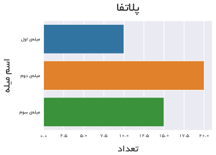

# plotfa
plotfa defines a set of helper functions that will aid you in creating crisp and beautiful plots in Persian, using seaborn (preferably) or pure matplotlib.

## Installation
plotfa can be installed using `pip`:

`pip install plotfa`

## Basic Usage
After installing `plotfa`, we simply import it at the top of our file:

```python
import plotfa
```

It's important to note that any bit of persian text
that we want shown on the plot, *must* pass through the `plotfa.fa()` function. For simplicity, we explicitly import this function on the top:

```python
from plotfa import fa
```

Now, let's say we want to create a little bar plot using seaborn, so:
```python
import seaborn as sns
from plotfa import farsi as fa
import plotfa

sns.set_style('darkgrid')
# Set plot's settings
plotfa.set_font('B Yekan')  # It defaults to B Yekan already
plotfa.prettify()  # To make our plots look better

# We must wrap persian strings with the fa() function

y = [       
     fa('میله‌ی اول'),
     fa('میله‌ی دوم'),
     fa('میله‌ی سوم')
    ]
x = [
     10,
     20,
     15
    ]

sample_plot = sns.barplot(x, y) # save the returned plot object
# pass the plot object into modify_plot and set its title and labels
plotfa.modify_plot(plot=sample_plot,
                   title=fa('پلاتفا'),
                   xlabel=fa('تعداد'),
                   ylabel=fa('اسم میله'))
```
Running the above code, will result in the following plot:



